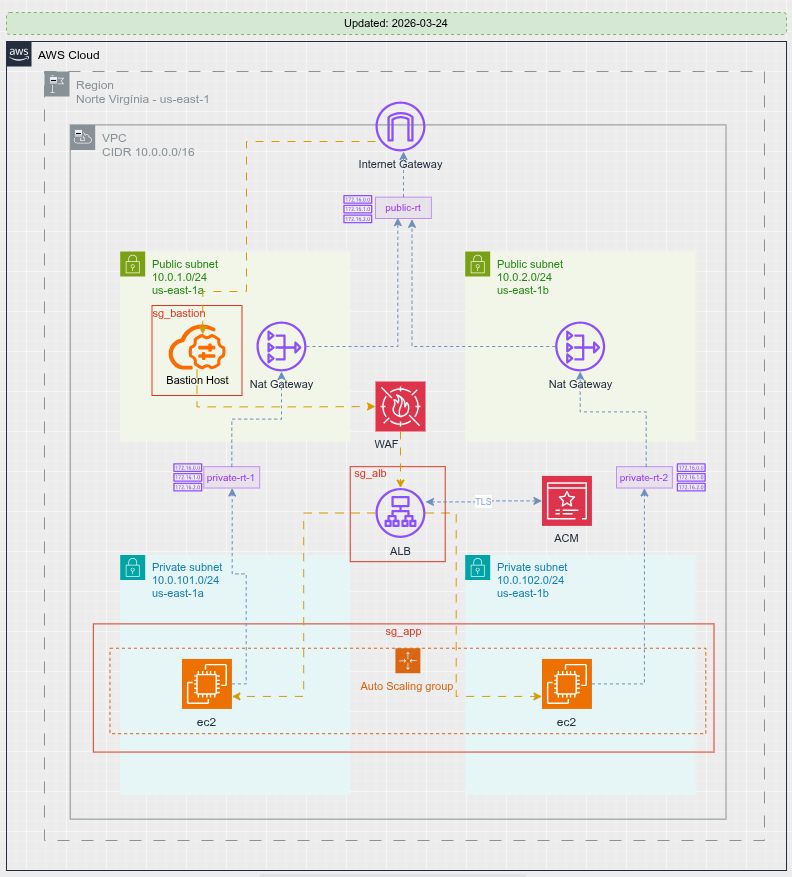

# 🛡️ AWS Secure Infrastructure

Terraform project to deploy an internal application with secure infrastructure on AWS, adhering to best practices and standard for the HashiCorp Registry.


## 🕸️ Network Topology



## 📐 Architecture and Security Decisions

The architecture was designed simulating a real corporate environment focusing on high security and scalability:

- **Private by Default**: No application instances (EC2) have a public IP (`associate_public_ip_address = false`). The application is not directly accessible from the internet.
- **Internal Application Load Balancer (ALB)**: The ALB is associated with private subnets and configured as internal (`internal = true`). It does not respond externally and its Security Group (`SG-ALB`) only accepts traffic from the internal network.
- **Bastion Host**: Administrative access (SSH) occurs exclusively through a Bastion Host located in a public subnet, whose Security Group (`SG-BASTION`) restricts access to configured trusted IPs (applies the principle of least privilege, avoiding broad `0.0.0.0/0`).
- **Controlled External Access**: Private instances use a NAT Gateway (located in the public subnets) for controlled outbound communication (egress) and package updates, without having a direct route to the Internet Gateway (IGW).
- **Micro-segmentation via Security Groups**:
  - `SG-APP` restricts application traffic to accept connections **ONLY** from `SG-ALB`.
  - `SG-APP` restricts SSH traffic to accept connections **ONLY** from the Bastion.

## 📖 How to Use (Deploy and Destroy)

The provisioned infrastructure can be initialized and deployed from the desired environment directory (e.g., `environments/dev`):

1. **Access the environment directory:**

   ```bash
   cd environments/dev
   ```

2. **Create the SSH key (if it doesn't exist in the `keys` folder yet):**

   ```bash
   ssh-keygen -t rsa -b 4096 -f keys/projeto-aws-key -N ""
   ```

3. **Initialize Terraform** (downloading modules and configuring the backend):

   ```bash
   terraform init
   ```

4. **Validate changes and generate the execution plan:**

   ```bash
   terraform plan -out plan.out
   ```

5. **Apply the modifications to provision the infrastructure:**

   ```bash
   terraform apply plan.out
   ```

6. **Deprovisioning (Destroy)**: To delete all created resources after testing:

   ```bash
   terraform destroy
   ```

---

<!-- BEGINNING OF PRE-COMMIT-TERRAFORM DOCS HOOK -->
## Requirements

| Name | Version |
|------|---------|
| <a name="requirement_terraform"></a> [terraform](#requirement\_terraform) | >= 1.3.0, < 2.0.0 |
| <a name="requirement_aws"></a> [aws](#requirement\_aws) | ~> 6.0 |

## Providers

| Name | Version |
|------|---------|
| <a name="provider_aws"></a> [aws](#provider\_aws) | ~> 6.0 |

## Modules

| Name | Source | Version |
|------|--------|---------|
| <a name="module_alb"></a> [alb](#module\_alb) | ../../modules/alb | n/a |
| <a name="module_app"></a> [app](#module\_app) | ../../modules/app | n/a |
| <a name="module_bastion"></a> [bastion](#module\_bastion) | [smartao/bastion/aws](https://github.com/smartao/terraform-aws-bastion) | 3.0.0 |
| <a name="module_network"></a> [network](#module\_network) | [smartao/secure-vpc/aws](https://github.com/smartao/terraform-aws-secure-vpc) | 1.1.0 |

## Resources

No resources.

## Inputs

| Name | Description | Type | Default | Required |
|------|-------------|------|---------|:--------:|
| <a name="input_alb_allowed_egress_cidr_blocks"></a> [alb\_allowed\_egress\_cidr\_blocks](#input\_alb\_allowed\_egress\_cidr\_blocks) | CIDR blocks the internal ALB can reach on the target group port | `list(string)` | `[]` | no |
| <a name="input_alb_allowed_ingress_cidr_blocks"></a> [alb\_allowed\_ingress\_cidr\_blocks](#input\_alb\_allowed\_ingress\_cidr\_blocks) | Trusted CIDR blocks allowed to access the internal ALB listener | `list(string)` | `[]` | no |
| <a name="input_alb_listener_port"></a> [alb\_listener\_port](#input\_alb\_listener\_port) | The port on which the internal ALB listens | `number` | n/a | yes |
| <a name="input_alb_listener_protocol"></a> [alb\_listener\_protocol](#input\_alb\_listener\_protocol) | The protocol used by the internal ALB listener | `string` | `"HTTP"` | no |
| <a name="input_app_html_page"></a> [app\_html\_page](#input\_app\_html\_page) | The HTML template deployed by the application user data | `string` | `"index.html.tpl"` | no |
| <a name="input_app_port"></a> [app\_port](#input\_app\_port) | The port on which the application listens | `number` | n/a | yes |
| <a name="input_app_protocol"></a> [app\_protocol](#input\_app\_protocol) | The protocol used by the application (e.g., HTTP, HTTPS) | `string` | n/a | yes |
| <a name="input_app_script"></a> [app\_script](#input\_app\_script) | The application script to initialize the EC2 instances | `string` | n/a | yes |
| <a name="input_asg_desired_capacity"></a> [asg\_desired\_capacity](#input\_asg\_desired\_capacity) | Desired number of instances in the ASG | `number` | n/a | yes |
| <a name="input_asg_max_size"></a> [asg\_max\_size](#input\_asg\_max\_size) | Maximum number of instances in the ASG | `number` | n/a | yes |
| <a name="input_asg_min_size"></a> [asg\_min\_size](#input\_asg\_min\_size) | Minimum number of instances in the ASG | `number` | n/a | yes |
| <a name="input_azs"></a> [azs](#input\_azs) | A list of availability zones to use | `list(string)` | n/a | yes |
| <a name="input_bastion_script"></a> [bastion\_script](#input\_bastion\_script) | The user data script to initialize the bastion host | `string` | `"bastion.sh"` | no |
| <a name="input_bastion_ssh_ingress_cidrs"></a> [bastion\_ssh\_ingress\_cidrs](#input\_bastion\_ssh\_ingress\_cidrs) | List of CIDR blocks allowed to SSH into the bastion host | `list(string)` | n/a | yes |
| <a name="input_environment"></a> [environment](#input\_environment) | Environment (e.g., dev, stg, prod) | `string` | `"dev"` | no |
| <a name="input_health_check_interval"></a> [health\_check\_interval](#input\_health\_check\_interval) | Approximate amount of time, in seconds, between health checks | `number` | `30` | no |
| <a name="input_health_check_matcher"></a> [health\_check\_matcher](#input\_health\_check\_matcher) | The HTTP codes to use when checking for a successful health check response | `string` | `"200"` | no |
| <a name="input_health_check_path"></a> [health\_check\_path](#input\_health\_check\_path) | The destination for the ALB target group health check request | `string` | `"/"` | no |
| <a name="input_health_check_timeout"></a> [health\_check\_timeout](#input\_health\_check\_timeout) | Amount of time, in seconds, during which no response means a failed health check | `number` | `5` | no |
| <a name="input_healthy_threshold"></a> [healthy\_threshold](#input\_healthy\_threshold) | Number of consecutive successful health checks required before considering a target healthy | `number` | `2` | no |
| <a name="input_instance_type"></a> [instance\_type](#input\_instance\_type) | The instance type for the EC2 instances | `string` | n/a | yes |
| <a name="input_owner"></a> [owner](#input\_owner) | Resource owner | `string` | n/a | yes |
| <a name="input_private_subnet_cidrs"></a> [private\_subnet\_cidrs](#input\_private\_subnet\_cidrs) | A list of CIDR blocks for the private subnets | `list(string)` | n/a | yes |
| <a name="input_project"></a> [project](#input\_project) | Project name | `string` | n/a | yes |
| <a name="input_public_subnet_cidrs"></a> [public\_subnet\_cidrs](#input\_public\_subnet\_cidrs) | A list of CIDR blocks for the public subnets | `list(string)` | n/a | yes |
| <a name="input_region"></a> [region](#input\_region) | AWS region | `string` | n/a | yes |
| <a name="input_ssh_key_name"></a> [ssh\_key\_name](#input\_ssh\_key\_name) | Filename of the SSH public key stored in the keys directory | `string` | n/a | yes |
| <a name="input_unhealthy_threshold"></a> [unhealthy\_threshold](#input\_unhealthy\_threshold) | Number of consecutive failed health checks required before considering a target unhealthy | `number` | `2` | no |
| <a name="input_vpc_cidr"></a> [vpc\_cidr](#input\_vpc\_cidr) | The CIDR block for the VPC | `string` | n/a | yes |

## Outputs

| Name | Description |
|------|-------------|
| <a name="output_access_information"></a> [access\_information](#output\_access\_information) | Useful commands and URLs |
<!-- END OF PRE-COMMIT-TERRAFORM DOCS HOOK -->
